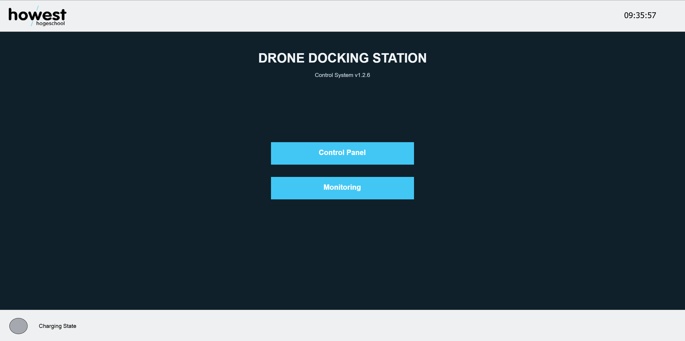
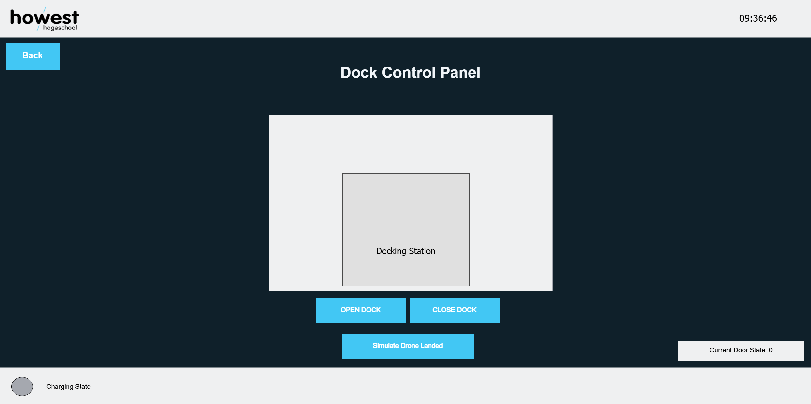
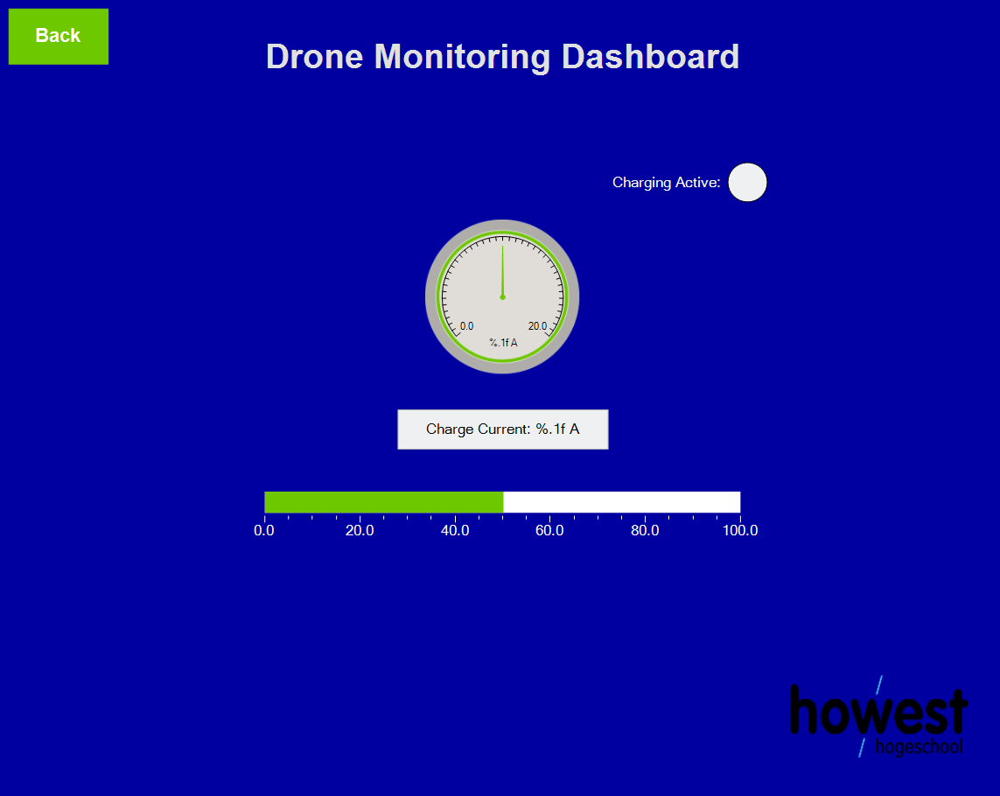

#  Cipher-Bay  Drone Docking Station: Full Project Documentation

> **Internship Cipher-Bay | Howest Cyber3Lab**
> Platform: CODESYS 3.5 - Docker - Modbus TCP - WebVisu

---

## Table of Contents

1. [Project Overview](#1-project-overview)
2. [Technology Stack](#2-technology-stack)
3. [Repository Structure](#3-repository-structure)
4. [PLC Program (CODESYS)](#4-plc-program-codesys)
5. [The State Machine in Detail](#5-the-state-machine-in-detail)
6. [Charging & Docking Simulation Logic](#6-charging--docking-simulation-logic)
7. [Modbus TCP Integration](#7-modbus-tcp-integration)
8. [System Time & Clock](#8-system-time--clock)
9. [Door Animation Logic](#9-door-animation-logic)
10. [WebVisu HMI](#10-webvisu-hmi)
11. [Docker Infrastructure](#11-docker-infrastructure)
12. [Deployment Guide](#12-deployment-guide)
13. [Challenges & Solutions](#13-challenges--solutions)
14. [Architecture Diagram](#14-architecture-diagram)

---

## 1. Project Overview

**Cipher-Bay** is a complete, containerised Soft PLC control system for an automated drone docking station. The goal is to provide a hardware-independent, scalable solution that can run on any Linux server inside Docker, controlling the physical (simulated) states of a drone dock.

### What the system does

| Capability | Description |
|---|---|
| **Door State Machine** | Controls dock doors through four safe states: Closed  Opening  Open  Closing  Closed |
| **Docking Simulation** | Simulates a drone landing on the pad while doors are open |
| **Battery Charging** | Automatically charges the docked drone when the doors are safely closed |
| **Real-Time HMI** | Web-based operator UI (WebVisu) accessible from any browser on the network |
| **Modbus TCP Server** | Broadcasts live telemetry (door state, battery, current) on port 502 to external systems |
| **System Clock** | Reads the PLC real-time clock and formats the current time for display |

---

## 2. Technology Stack

| Layer | Technology | Purpose |
|---|---|---|
| **PLC Runtime** | CODESYS Control for Linux SL | The soft PLC engine that executes the IEC 61131-3 logic inside Docker |
| **PLC IDE** | CODESYS Development System 3.5 (Windows) | Used to write, compile, and push code to the runtime |
| **PLC Language** | Structured Text (ST)  IEC 61131-3 | The logic language used in PLC_PRG |
| **Gateway** | CODESYS Edge Gateway for Linux | Enables the Windows IDE to discover and communicate with the runtime over the network |
| **HMI** | CODESYS WebVisu | Browser-based HMI served directly by the runtime on port 8080 |
| **Industrial Protocol** | Modbus TCP (port 502) | Exposes PLC telemetry to external SCADA/IoT clients |
| **Containerisation** | Docker + Docker Compose | Packages the entire PLC runtime environment for reproducible deployment |
| **Base OS Image** | debian:trixie-slim | Minimal Debian Linux base for the Docker image |
| **Test Client** | Python 3 + pymodbus | Validates Modbus register values against expected ranges |

---

## 3. Repository Structure

```
Cipher-Bay/
 README.md                      # Project overview and quick-start
 docs.md                        # This file: Full technical documentation
 .gitignore

 Images/                        # Screenshots used in documentation
    menu.png                   # WebVisu - Main Menu screen
    menu_old.png               # Earlier design iteration
    control-panel.png          # WebVisu - Control Panel screen
    control-panel_old.png      # Earlier design iteration
    monitoring.png             # WebVisu - Monitoring Dashboard screen
    monitoring_old.png         # Earlier design iteration
    drone.svg                  # Drone SVG asset used in the HMI
    howest_logo.png            # Howest branding asset

 Modbus-TCP/
    modbus_check.py            # Python Modbus TCP validation script

 docker/
    Dockerfile                 # Builds the base image (SSH + dependencies)
    docker-compose.yml         # Orchestrates the runtime container
    deployment.md              # Step-by-step deployment guide
    codesys_data/              # Persistent volume directory
        PlcLogic/
           Application/
               Application.app   # Compiled PLC binary (deployed by IDE)
               Application.crc   # CRC checksum of the compiled application
        cfg/                   # CODESYS runtime configuration
        logs/                  # Runtime log output

 PLC-Program/                   # CODESYS project source files (IDE project)
```

**Note on Application.app:** This is the compiled binary pushed by the CODESYS IDE into the Docker volume mount. When the PLC runtime boots, it automatically loads and runs this file regardless of whether any IDE is connected.

---

## 4. PLC Program (CODESYS)

The PLC logic is written in **Structured Text (ST)** using CODESYS 3.5.

### 4.1 Data Types (DUTs)  E_DockState

An enumeration (ENUM) defining all valid states the dock can be in.

```pascal
TYPE E_DockState :
(
    CLOSED  := 0,
    OPENING := 1,
    OPEN    := 2,
    CLOSING := 3
);
END_TYPE
```

| Value | Name | Meaning |
|---|---|---|
| 0 | CLOSED | Dock sealed; charging is active if drone is present |
| 1 | OPENING | Doors animating open; transition lasts DOOR_TRANSITION_TIME (2s) |
| 2 | OPEN | Drone can land or take off |
| 3 | CLOSING | Doors animating closed; transition lasts DOOR_TRANSITION_TIME (2s) |

---

### 4.2 Global Variable List (GVL_DroneDock)

All variables shared between the PLC program and the Modbus/HMI layers are declared in GVL_DroneDock.

#### Constants (VAR_GLOBAL CONSTANT)

| Name | Type | Value | Description |
|---|---|---|---|
| MAX_BATTERY_LEVEL | REAL | 100.0 | Maximum battery percentage |
| CHARGE_CURRENT_MAX | REAL | 5.2 | Charging current in Amps |
| CHARGE_RATE_SIM | REAL | 0.5 | Battery % added per simulation tick (every 1 second) |
| DOOR_TRANSITION_TIME | TIME | T#2S | Time for doors to fully open or close |

#### HMI Command Inputs (set by WebVisu operator)

| Name | Type | Description |
|---|---|---|
| xCmdOpen | BOOL | Pulse TRUE to trigger door opening |
| xCmdClose | BOOL | Pulse TRUE to trigger door closing |
| xCmdSimulateDocking | BOOL | Toggle to simulate drone on pad |

#### System Status

| Name | Type | Default | Description |
|---|---|---|---|
| eCurrentState | E_DockState | CLOSED | Current door state |
| xIsDocked | BOOL | FALSE | TRUE when a drone is on the landing pad |
| xIsCharging | BOOL | FALSE | TRUE when active charging is occurring |
| rBatteryLevel | REAL | 20.0 | Current battery level in % |
| rChargeCurrent | REAL | 0.0 | Active charge current in Amps |

#### Modbus Transmission Variables

| Name | Type | Description |
|---|---|---|
| mb_iState | WORD | Door state as integer (0-3) |
| mb_iBatteryLevel | WORD | Battery % x10 (e.g., 955 = 95.5%) |
| mb_iChargeCurrent | WORD | Current x10 (e.g., 52 = 5.2A) |
| mb_xIsDocked | BOOL | Docked flag  Modbus Discrete Input (Coil) |
| mb_xIsCharging | BOOL | Charging flag  Modbus Discrete Input (Coil) |

---

### 4.3 Main Program  PLC_PRG (Local Variables)

```pascal
PROGRAM PLC_PRG
VAR
    tonDoorTimer      : TON;        // Timer for door opening/closing transition
    tonChargePulse    : TON;        // Self-resetting timer for charging ticks (1s)

    dtFullSystemTime  : DT;         // Raw Date & Time from RTC
    todOnlyTime       : TOD;        // Only the time-of-day portion
    sRawTimeString    : STRING;     // Intermediate TOD string e.g. "TOD#12:34:56"
    sFormattedTime    : STRING(8);  // Final clean output: "HH:MM:SS"
    udiRtcResult      : UDINT;      // Error code output from SysTimeRtcGet()

    eCurrentDockState : E_DockState;
    iRightDockAngle   : INT;        // Right door rotation angle (0-90 degrees)
    iLeftDockAngle    : INT;        // Left door (mirrored)
END_VAR
```

#### Section Summary

| Section | What It Does |
|---|---|
| 1. Door Control State Machine | Core FSM  handles state transitions with timed door movement |
| 2. Docking & Charging Logic | Manages drone docking simulation and battery charging |
| 3. Modbus Data Preparation | Converts native types to 16-bit WORD for Modbus |
| 4. System Time | Reads RTC clock and formats current time as HH:MM:SS |
| 5. Door Animation Angles | Calculates per-frame door angle for WebVisu animation |

---

### 4.4 Task Configuration

| Task | Type | Assigned POUs |
|---|---|---|
| MainTask | IEC-Task (Cyclic) | PLC_PRG |
| VISU_TASK | IEC-Task (Visu cycle) | VisuElems.Visu_Prg |

VISU_TASK is a dedicated task for rendering the WebVisu interface, keeping HMI updates decoupled from control logic timing.

---

## 5. The State Machine in Detail

The dock door is controlled by a Finite State Machine (FSM) using a CASE statement. A TON timer enforces a 2-second physical transition time for both opening and closing.

**Key safety rule:** The command variables (xCmdOpen, xCmdClose) are **consumed** (set to FALSE) immediately when detected. This prevents re-triggering on the next scan cycle. The timer controls actual transition timing. Section 5 (animation) reads the same state machine but does NOT drive transitions.

---

## 6. Charging & Docking Simulation Logic

Two physical safety rules are enforced:

1. **A drone can only be docked while the doors are OPEN.**
   xIsDocked mirrors xCmdSimulateDocking only when eCurrentState = OPEN.

2. **Charging only occurs when xIsDocked = TRUE AND eCurrentState = CLOSED.**
   Charging while the bay is exposed is treated as unsafe.

**Charging simulation flow (ticks every 1 second via self-resetting TON):**

- rBatteryLevel < 100%: xIsCharging=TRUE, rChargeCurrent=5.2A, rBatteryLevel += 0.5% per tick
- rBatteryLevel >= 100%: xIsCharging=FALSE, rChargeCurrent=0.0, battery clamped to 100%
- Not docked or doors open: xIsCharging=FALSE, rChargeCurrent=0.0, timer reset

The tonChargePulse timer is self-resetting: IN := NOT tonChargePulse.Q. When the timer fires, its output resets it, creating an infinite 1-second tick.

---

## 7. Modbus TCP Integration

### 7.1 CODESYS-Side Configuration

```
Device (CODESYS Control for Linux SL)
 Ethernet (interface: eth0)
     ModbusTCP_Server_Device
```

**Configuration steps taken:**
1. Added an **Ethernet** device node bound to eth0.
2. Added a **ModbusTCP Server Device** inside it.
3. In **Device I/O Mapping**: assigned mb_iState, mb_iBatteryLevel, mb_iChargeCurrent to Input Registers (%QW0, %QW1, %QW2).
4. In the **General tab**: enabled **Discrete Bit Areas** to expose BOOL variables as Discrete Inputs. Assigned mb_xIsDocked (Bit 0) and mb_xIsCharging (Bit 1).

**Why scale REALs by x10?**
Standard Modbus registers are 16-bit integers. REAL (float) values cannot be natively transmitted. Multiplying by 10 before converting to WORD preserves one decimal place. Clients divide by 10 to recover the original value.

---

### 7.2 Register Map

Modbus TCP Server on **port 502**.

#### Input Registers (FC04  Read Only)

| Register | Address | CODESYS Variable | Scale | Example |
|---|---|---|---|---|
| Door State | %QW0 (Reg 0) | mb_iState | None | 2 = OPEN |
| Battery Level | %QW1 (Reg 1) | mb_iBatteryLevel | x10 | 955 = 95.5% |
| Charge Current | %QW2 (Reg 2) | mb_iChargeCurrent | x10 | 52 = 5.2A |

#### Discrete Inputs (FC02  Read Only)

| Bit | CODESYS Variable | Description |
|---|---|---|
| Bit 0 | mb_xIsDocked | TRUE if drone is on the landing pad |
| Bit 1 | mb_xIsCharging | TRUE if active charging is occurring |

---

### 7.3 Python Test Client (modbus_check.py)

Located in Modbus-TCP/modbus_check.py. Uses **pymodbus** to validate register values against expected ranges.

**Usage:**
```bash
pip install pymodbus
python modbus_check.py <SERVER_IP>
```

**Configured checks:**

| FC | Address | Check Type | Expected |
|---|---|---|---|
| FC04 | Reg 0 | Exact | 0 (CLOSED state on startup) |
| FC04 | Reg 1 | Exact | 200 (20.0%  startup battery level) |
| FC04 | Reg 1 | Range | 0-1000 (valid battery range) |
| FC04 | Reg 2 | Range | 0-52 (valid current: 0-5.2A) |

Returns a JSON array of {"Path": ["modbus", "FC04"], "Passed": true/false} objects for integration with automated test pipelines.

---

## 8. System Time & Clock

The PLC reads its RTC every scan cycle using SysTimeRtcGet() and formats it for WebVisu display.

**Processing pipeline:**

```pascal
// Step 1: Read RTC - get Date & Time
dtFullSystemTime := TO_DT(SysTimeRtcGet(udiRtcResult));

// Step 2: Strip date component - keep Time of Day only
todOnlyTime := TO_TOD(dtFullSystemTime);

// Step 3: Convert to string - "TOD#12:34:56"
sRawTimeString := TO_STRING(todOnlyTime);

// Step 4: Extract last 8 characters - "12:34:56"
sFormattedTime := RIGHT(STR := sRawTimeString, SIZE := 8);
```

sFormattedTime (8 chars, HH:MM:SS) is displayed directly in the WebVisu HMI.
The Docker container timezone is set to **Europe/Brussels** via the TZ environment variable.

---

## 9. Door Animation Logic

The WebVisu shows a real-time animated view of dock doors opening and closing. Animation is driven in PLC logic using integer degree values:

- iRightDockAngle: 0 (closed) to 90 (fully open), incremented/decremented each scan cycle
- iLeftDockAngle: always the negative mirror (iRightDockAngle * -1)

The WebVisu reads these angle variables and rotates graphical elements accordingly.
**State transitions are NOT handled here**  Section 1 (state machine) is the single source of truth.

---

## 10. WebVisu HMI

Served by the CODESYS runtime on **port 8080**. Access at:

```
http://<SERVER_IP>:8080/webvisu.htm
```

Three visualization screens:

### VIS_Home  Main Menu
The landing page. Navigation buttons to the other two screens.



### VIS_ControlPanel  Control Panel
Operator interface for controlling the dock:
- **Open Door** button  sets xCmdOpen = TRUE
- **Close Door** button  sets xCmdClose = TRUE
- **Simulate Docking** toggle  sets xCmdSimulateDocking = TRUE/FALSE
- **Animated dock view**  doors rotate in real time using iRightDockAngle / iLeftDockAngle
- **Drone SVG** (drone.svg) shown/hidden based on xIsDocked
- **Door State**  text/indicator from eCurrentState



### VIS_Monitoring  Monitoring Dashboard
Read-only telemetry dashboard:
- **Battery Level**  gauge/bar from rBatteryLevel
- **Charge Current**  numeric display from rChargeCurrent
- **Is Charging**  indicator light from xIsCharging
- **Current Time**  formatted clock from sFormattedTime (HH:MM:SS)




---

## 11. Docker Infrastructure

### 11.1 Dockerfile

**File:** docker/Dockerfile
**Base image:** debian:trixie-slim

Builds a base Linux image with all system dependencies for CODESYS. The runtime itself is NOT included in the Dockerfile  it is installed via the CODESYS IDE's Deploy tool over SSH.

**Installed packages:**

| Package | Reason |
|---|---|
| openssh-server | Allows CODESYS IDE to SSH in to deploy the runtime |
| sudo | Required by the CODESYS installer |
| libgcc-s1, libc6 | Core C runtime libraries |
| libpthread-stubs0-dev | POSIX threading support |
| libdbus-1-3 | D-Bus IPC used by CODESYS |
| udev | Device management required by the runtime |
| libcurl4 | HTTP library used by CODESYS |
| wget | Package downloading utility |

**User setup:**
- Creates user codesys / password codesys
- Full passwordless sudo (required by CODESYS installer)
- SSH allows password authentication and root login

**Exposed port:** 22 (SSH)
**CMD:** /usr/sbin/sshd -D

---

### 11.2 docker-compose.yml

**File:** docker/docker-compose.yml

The compose file orchestrates the final "frozen" image (codesys-runtime-live:v1) that already has CODESYS installed.

**Startup command:**
```bash
/etc/init.d/codesyscontrol start && /etc/init.d/codesysedge start && /usr/sbin/sshd && sleep 6600
```
Boots: PLC runtime  Edge Gateway  SSH daemon.

**Port mappings:**

| Host Port | Container Port | Protocol | Service |
|---|---|---|---|
| 2222 | 22 | TCP | SSH  used by CODESYS Deploy Tool |
| 502 | 502 | TCP | Modbus TCP |
| 8080 | 8080 | TCP | WebVisu HMI |
| 11740 | 11740 | TCP + UDP | CODESYS runtime communication |
| 1217 | 1217 | TCP + UDP | CODESYS Edge Gateway |

**Why TCP + UDP for 11740 and 1217?**
The CODESYS IDE uses UDP broadcasts to discover devices on the network. Without UDP, the IDE cannot find the PLC automatically.

**Linux capabilities:**

| Capability | Reason |
|---|---|
| SYS_NICE | Allows CODESYS to set real-time scheduling priorities |
| NET_ADMIN | Required for Modbus networking |
| SYS_RAWIO | Low-level I/O for the soft PLC |

**ulimits memlock: -1**  Removes memory locking limit (required for real-time Linux processes).
**mac_address: 02:42:ac:11:00:02**  Fixed MAC; some CODESYS licenses are MAC-locked.
**TZ: Europe/Brussels**  Sets the timezone for the RTC clock displayed in WebVisu.

---

### 11.3 Volume Mounts & Persisted Data

| Host Path (inside docker/) | Container Path | Purpose |
|---|---|---|
| codesys_data/PlcLogic | /var/opt/codesys/PlcLogic | Compiled PLC application (Application.app + .crc) |
| codesys_data/cfg | /etc/CODESYSControl | Runtime configuration files |
| codesys_data/logs | /var/log/codesys | Runtime log output |

**Critical:** Application.app lives in a volume, so the PLC program survives container recreations and is loaded automatically on every boot.

---

## 12. Deployment Guide

### Overview: The Frozen Image Strategy

Because the CODESYS runtime is proprietary and cannot be published to a public Docker registry, this project uses a two-phase deployment:

1. **Phase 1 (One-time):** Build the base image, install CODESYS via the IDE's Deploy tool, then export the container as a .tar archive (the "frozen image").
2. **Phase 2 (Normal deployment):** Load the .tar on any new server, run docker compose up -d. No IDE tools required.

---

### Phase 1: Initial Runtime Installation (One-Time Setup)

**Step 1: Build and start the base container**
```bash
cd docker/
docker compose up -d
```

**Step 2: Install CODESYS runtime using the IDE (Windows)**
- Open CODESYS 3.5 on your Windows machine
- Go to Tools  Deploy Control SL in the top menu bar
- Set: IP address of the server, port 2222, username codesys, password codesys
- Click Connect
- Go to the Deployment tab
- Install: CODESYS Control for Linux SL AND CODESYS Edge Gateway for Linux

**Step 3: Freeze the image**
```bash
docker commit codesys-setup codesys-runtime-live:v1
docker save -o codesys-live-backup.tar codesys-runtime-live:v1
```

---

### Phase 2: Fresh Server Deployment

**Step 1: Clone the repository**
```bash
git clone https://github.com/attilapeterszucs/Cipher-Bay.git
cd Cipher-Bay/docker
```

**Step 2: Load the frozen image**
```bash
wget https://<your-hosting-url>/codesys-live-backup.tar
sudo docker load -i codesys-live-backup.tar
```
You should see: Loaded image: codesys-runtime-live:v1

**Step 3: Start the system**
```bash
sudo docker compose up -d
```

**Step 4: Verify**
```bash
sudo docker ps   # codesys-runtime should show as "Up"
```

**Step 5: Access WebVisu**
```
http://<SERVER_IP>:8080/webvisu.htm
```

---

### Pushing Updated PLC Code

1. Open the CODESYS 3.5 project on Windows
2. Double-click the Device node in the project tree
3. Enter the Server IP and connect via the Edge Gateway
4. Press Alt+F8 (Login)  accept the download prompt
5. Press F5 (Start) to begin execution

The IDE compiles the project and pushes the new Application.app directly into the Docker volume mount. The PLC begins running the new code immediately.

---

## 13. Challenges & Solutions

### Challenge 1: Installing CODESYS Runtime into Docker

**Problem:** The CODESYS soft PLC runtime is proprietary software. It cannot be apt installed or pulled from Docker Hub. It must be installed through the CODESYS IDE's own deployment tool, which communicates with the target Linux machine via SSH.

**Solution:**
- The Dockerfile creates a minimal Debian container with SSH and all required system dependencies.
- In the CODESYS IDE: **Tools  Deploy Control SL** is used to connect to the container over SSH (port 2222).
- The **Deployment tab** installs the two required packages:
  - CODESYS Control for Linux SL (the PLC runtime)
  - CODESYS Edge Gateway for Linux (enables IDE-to-PLC communication)
- After installation, the container is committed into a "frozen" Docker image, which can be deployed anywhere without repeating this process.

---

### Challenge 2: Connecting the IDE and Pushing PLC Code to the Docker Container

**Problem:** After the runtime is installed, the CODESYS IDE needs to discover the PLC on the network, log in, and download compiled code  just like it would with a real hardware PLC.

**Solution:**
- The CODESYS Edge Gateway acts as a network bridge. Its port (1217) is exposed from the container, both TCP and UDP.
- The Gateway's UDP broadcast allows the IDE's device scanner to auto-discover the PLC.
- Port 11740 (also both TCP and UDP) is the direct CODESYS runtime communication port.
- With both ports correctly mapped in docker-compose.yml, the IDE can add a Gateway pointing to the server IP, discover the codesys-plc device, and perform a normal Login + Download flow.

---

### Challenge 3: Adding Modbus TCP and Mapping Variables

**Problem:** CODESYS does not come with Modbus TCP configured out of the box. The register-to-variable mapping must be set up correctly, and BOOL discrete inputs are not available by default.

**Solution  step by step:**
1. A new **Ethernet** device was added under the Device node in the project tree, configured for eth0.
2. Inside Ethernet, a **ModbusTCP Server Device** was added.
3. In **Device I/O Mapping**: mb_iState, mb_iBatteryLevel, mb_iChargeCurrent were assigned to Input Registers at %QW0, %QW1, %QW2.
4. In the **General tab** of the ModbusTCP Server Device: **Discrete Bit Areas were enabled**. Once enabled, bit-level rows appeared in the Device I/O Mapping where mb_xIsDocked and mb_xIsCharging were assigned as Discrete Inputs (Bit 0 and Bit 1).
5. Because Modbus registers are 16-bit integers, PLC Section 3 multiplies REAL values by 10 before casting to WORD. Python test clients divide by 10 when reading.

---

## 14. Architecture Diagram

```
+----------------------------------------------------------------+
|                    Linux Server (Docker Host)                  |
|                                                                |
|  +----------------------------------------------------------+  |
|  |            Docker Container: codesys-runtime             |  |
|  |                                                          |  |
|  |  +---------------------------------------------------+   |  |
|  |  |       CODESYS Control for Linux SL               |   |  |
|  |  |   (Soft PLC Runtime - runs Application.app)      |   |  |
|  |  |                                                   |   |  |
|  |  |  +-----------------+  +------------------------+  |   |  |
|  |  |  |  PLC_PRG (ST)   |  |   WebVisu Server       |  |   |  |
|  |  |  | State Machine   |  |   (port 8080)          |  |   |  |
|  |  |  | Charging Logic  |  +------------------------+  |   |  |
|  |  |  | Modbus Prep     |  +------------------------+  |   |  |
|  |  |  | Clock / Angles  |  |  ModbusTCP Server      |  |   |  |
|  |  |  +-----------------+  |  (port 502)            |  |   |  |
|  |  |  +-----------------+  +------------------------+  |   |  |
|  |  |  | GVL_DroneDock   |                             |   |  |
|  |  |  | (shared vars)   |                             |   |  |
|  |  |  +-----------------+                             |   |  |
|  |  +---------------------------------------------------+   |  |
|  |                                                          |  |
|  |  +--------------------------+  +--------------------+    |  |
|  |  | CODESYS Edge Gateway     |  |    SSH Daemon      |    |  |
|  |  | (ports 1217 TCP+UDP)     |  |    (port 2222)     |    |  |
|  |  +--------------------------+  +--------------------+    |  |
|  |                                                          |  |
|  |  Volume: codesys_data/PlcLogic/Application/              |  |
|  |          Application.app  <-- compiled PLC binary        |  |
|  +----------------------------------------------------------+  |
+----------------------------------------------------------------+
         |                    |                    |
         | port 8080          | port 502           | ports 1217/11740
         v                    v                    v
  +--------------+   +---------------+   +-------------------+
  | Web Browser  |   | Python Script |   | CODESYS IDE       |
  | (Operator)   |   | modbus_check  |   | (Windows Dev PC)  |
  | WebVisu HMI  |   | .py / SCADA   |   | Login + Download  |
  +--------------+   +---------------+   +-------------------+
```

---

*Documentation created: 2026-04-01 | Project: Cipher-Bay | Howest Cyber3Lab Internship by Attila Peter Szucs*
